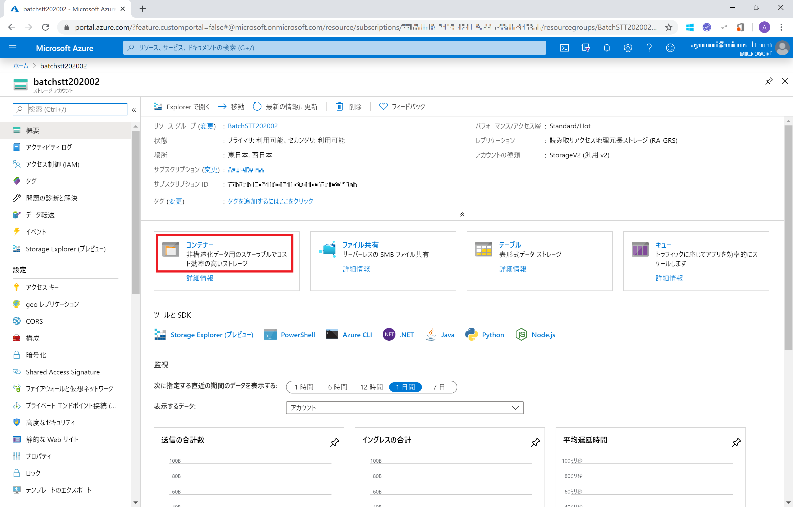
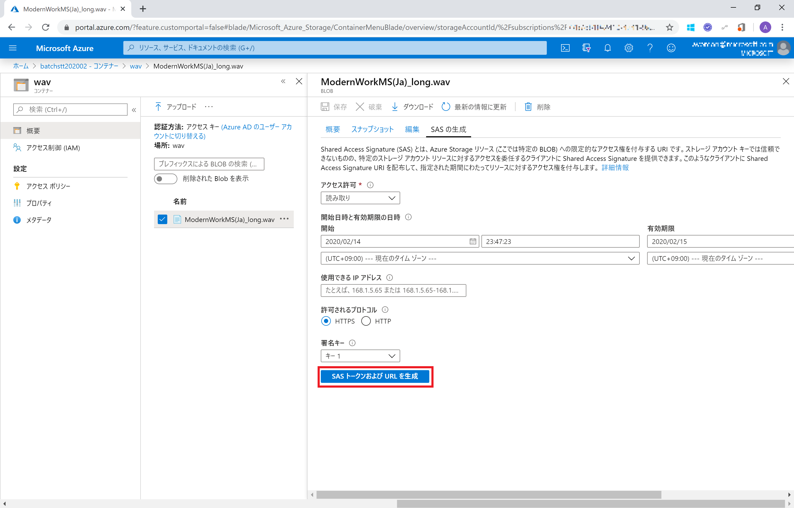
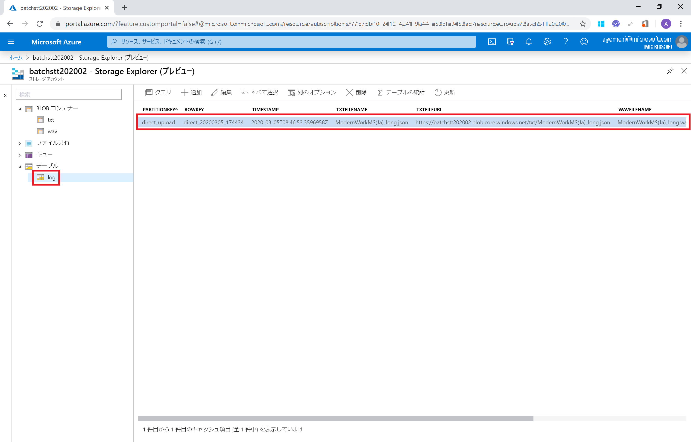

# Microsoft Cognitive Services を利用した 音声文字起こしアプリ 開発 (202002 版: Speech Services バッチ音声認識)

"人工知能 API" [Microsoft Azure Cognitive Services](https://www.microsoft.com/cognitive-services/) を使うと、さまざまな認知機能を行う AI エンジンをノーコーディングで利用、作成できます。

[Speech Services](https://azure.microsoft.com/ja-jp/services/cognitive-services/speech-services/) は、音声⇔テキストの変換を行うエンジンをすぐに Web API で利用できるサービスです。

ここでは、Azure Blob Storage にアップロードした音声ファイル(wav形式) から Speech Services を利用して文字起こしするソリューションを構成します。
Web App から Azure Blob Storage に音声ファイルをアップロードし、Blob Trigger で起動する Azure Functions でバッチ文字起こしを行います。


> アプリの動作は、[オンラインアプリサンプル](https://sttbatchweb202002.azurewebsites.net/) でご確認ください。


## 目次

0. [準備](#準備)
1. Speech Services の機能を確認
    - [1.1 Speech Services API](#1-1-speech-services-api)
    - [1.2 Custom Speech API](#1-2-custom-speech-api)
2. 音声ファイルをテキスト化するアプリの作成
    - [Azure Storage (Blob, Table) の準備](#azure-storage-blob-table-の準備)
    - [2.1 Azure Function](#2-1-azure-function)
    - [2.2 Azure App Service (Web App)](#2-2-azure-app-service)


## 準備

- Azure サブスクリプション & Speech Services のサービス申込
    - Azure サブスクリプション の申し込みには マイクロソフトアカウントが必要です。
    - [Azure 無償サブスクリプション準備](https://qiita.com/annie/items/3c9ddc3fb8f120769239) の手順で、Azure サブスクリプションと Speech Services の **有償(S0)** サブスクリプション申込を行います。
    - Speech Services を作成したロケーション (Location) と、API Key をローカルに保存しておきます。
    - 

- [Postman](https://www.postman.com/) などの Web API ツール

- [Visual Studio 2019](https://visualstudio.microsoft.com/ja/downloads/) などの C# 開発ツール (Visual Studio 2019 Community など無償版で OK)
    - Azure 開発ワークロード を合わせてインストールしてください ([手順](https://docs.microsoft.com/ja-jp/azure/azure-functions/functions-create-your-first-function-visual-studio))

- [CogServicesSpeechSamples_201907 - BatchTranscription_202002](https://github.com/ayako/CogServicesSpeechSamples_201907/tree/master/samples/SpeechToText/CSharp/BatchTranscription_202002) のディレクトリをローカルにダウンロードしておきます。このディレクトリだけを [ZIP でダウンロード できます](https://github.com/ayako/CogServicesSpeechSamples_201907/raw/master/samples/SpeechToText/CSharp/BatchTranscription_202002/BatchTranscription_202002.zip)。

- サンプル音声ファイル(wav) をダウンロードしておきます
    - [Short](https://github.com/ayako/AzureDXHol_AI_202001/raw/master/test_voice/ModernWorkMS(Ja)_short.wav)
    - [Long](https://github.com/ayako/AzureDXHol_AI_202001/raw/master/test_voice/ModernWorkMS(Ja)_long.wav)

## 手順

### 1. Speech Services の機能を確認

#### 1-1. Speech Services API

Postman から Speech Services Rest API でアクセスし、音声ファイルからテキストを取得します。YOUR_SERVICE_LOCATION を Speech Service のロケーション、YOUR_API_KEY を Speech Services の API Key で置き換えてください。

```
POST https://YOUR_SERVICE_LOCATION.api.cognitive.microsoft.com/speech/recognition/conversation/cognitiveservices/v1?language=ja-jp

Content-Type: audio/wav
Ocp-Apim-Subscription-Key: YOUR_API_KEY
```


Body は **Binary** をクリックし、[サンプル音声ファイル(short)](https://github.com/ayako/AzureDXHol_AI_202001/raw/master/test_voice/ModernWorkMS(Ja)_short.wav)を選択します。

> Rest API では 音声ファイルは WAV または OGG 形式、16 ビット、16 kHz、モノラル(1 channel) である必要があります。([ドキュメント](https://docs.microsoft.com/ja-jp/azure/cognitive-services/speech-service/rest-speech-to-text#audio-formats))


レスポンス、音声を分析したテキストが取得できるのを確認してください。


#### 1-2. Custom Speech API

通常の Speech Service API でテキストを取得できる音声ファイルは1分未満です。1分以上の音声ファイルは、Speech Services SDK または Custom Speech API を利用します。ここでは Custom Speech APi を利用して、音声ファイルをバッチで分析、テキストを取得します。バッチ文字起こしを利用する場合は、Azure Storage Blob に音声ファイルを保存、URLをリクエスト送信します。

##### Azure Storage の準備

Azure Portal で **[リソースの作成]** をクリックします。


*新規リソース作成* ペインから、**ストレージアカウント** をクリックします。


*ストレージアカウントの作成* ペインで、以下のように設定します。

- **リソースグループ** : 既存のリソースグループを選択、または **新規作成** をクリックしてお好みの名前で作成します
- **ストレージアカウント名** : お好みのものを (すべての Azure Storage アカウントで利用されていない名前を設定する必要があります)
- **場所** : 東日本 (Japan East) などお好みのロケーションを選択します

**[確認および作成]** をクリックして次のステップに進みます。


設定内容を確認して、**[作成]** をクリックすると、Azure Storage が作成されます。


*展開が成功しました* というメッセージが表示されたら、**[リソースに移動]** をクリックします。


*ストレージアカウント* ペインから [コンテナー] をクリックし、音声ファイルをアップロードするコンテナーを新規作成します。



**+コンテナー** をクリック、名前に **wav** と入力、パブリックアクセスレベルは **プライベート** (デフォルト)にしておきます。**[OK]** をクリックして作成します。


*wav* コンテナーが作成されたら、クリックします。


*wav コンテナー* ペインで **アップロード** をクリックします。


ファイルは [サンプル音声ファイル(long)](https://github.com/ayako/AzureDXHol_AI_202001/raw/master/test_voice/ModernWorkMS(Ja)_long.wav)を選択、**[アップロード]** をクリックして音声ファイルをアップロードします。


音声ファイルが問題なくアップロードされたら、*BLOB のアップロード* ペインは 右上の **×** をクリックして閉じます。


アップロードしたファイルの情報が表示されている列の右端にある **…** をクリック、**SAS の作成** をクリックします。


**[SASトークンおよびURLの作成]** をクリックして、アップロードした音声ファイルにSASトークンでアクセスできるURLを生成します。



生成された **BLOB SAS URL** をコピーして、ローカルに一旦保存しておきます。


ブラウザーで別タブを開いて Blob SAS URL をペーストし、アクセスできることを確認してください。


> SAS トークンを使うことで Azure Storage Blob に安全にアクセスできます。SAS トークンつきの URL から アップロードした音声ファイルにアクセスできるのを確認してください。SAS トークンなしの Blob URL ではアクセスできません。


##### Custom Speech API

Postman から Custom Speech API にアクセスし、バッチジョブを投入します。

OUR_SERVICE_LOCATION を Speech Service のロケーション、YOUR_API_KEY を Speech Services の API Key で置き換えてください。
また、Body の *recordingsUrl* には先ほど取得した SAS トークン付き Blob URL を設定します。

```
POST https://YOUR_SERVICE_LOCATION.cris.ai/api/speechtotext/v2.0/transcriptions

Content-Type: application/json
Ocp-Apim-Subscription-Key: YOUR_API_KEY

{
  "recordingsUrl": "YOUR_BLOB_URL_WITH_SASTOKEN",
  "models": [],
  "locale": "ja-jp",
  "name": "voice",
  "description": "Simple transcription (ja-JP)"
}
```

レスポンス 202 (Accepted) であれば、無事バッチジョブを投入できています。
レスポンスヘッダーに含まれる Location を用いてバッチジョブのステータスの確認、および結果を取得します。


*Location* の URL に GET でアクセスします。

```
GET https://YOUR_SERVICE_LOCATION.cris.ai/api/speechtotext/v2.0/transcriptions/TRANSCRIPTION_ID

Ocp-Apim-Subscription-Key: YOUR_API_KEY
```

> URL の末尾の文字列が、投入されたジョブに付与される Transcription Id になります。

*models* -> *status* が *Succeeded* であることを確認します。(*Not Started*, *Running* と表示される場合はしばらくしてからもう一度アクセスします。)

*resultUrls* -> *channel_0* に記載されている URL が音声ファイルの分析結果 (json) になります。


分析結果の URL にアクセスします。音声→テキストの分析結果が含まれているのを確認してください。


バッチジョブとその結果を削除します。

```
DELETE https://YOUR_SERVICE_LOCATION.cris.ai/api/speechtotext/v2.0/transcriptions/TRANSCRIPTION_ID

Ocp-Apim-Subscription-Key: YOUR_API_KEY
```

レスポンス 204 (No Content) であれば、無事ジョブを削除できています。


> Transcription Id なしで GET アクセスすると、残っているバッチジョブを確認できます。

```
GET https://YOUR_SERVICE_LOCATION.cris.ai/api/speechtotext/v2.0/transcriptions/
```

### 2. 音声ファイルをテキスト化するアプリの作成

Azure Storage Blob (wav コンテナー) へ音声ファイルをアップロードする操作、およびテキストファイルを取得する UI として Web アプリ (Azure App Service - Web App) を使用します。また、音声ファイルを Speech Services でバッチ処理でテキスト化する処理は、Azure Storage Blob が更新されることで起動する Blob Trigger を利用して Azure Function で行います。

#### Azure Storage (Blob, Table) の準備

Azure Storage の準備 と同じ手順で、作成した Azure Blob Storage にコンテナーを追加します。音声ファイルをアップロードする **wav** に加えて、Speech Services から取得したテキストファイルを保存する **txt** という名前のコンテナーを作成しておきます。


また、音声ファイルやテキストファイルを管理するためのテーブルを Azure Table Storage に作成します。ストレージアカウント ペインから [コンテナー] をクリックし、音声ファイルをアップロードするコンテナーを新規作成します。


**+テーブル** をクリック、名前に **log** と入力、**[OK]** をクリックして作成します。


#### 2-1. Azure Function

バッチ処理で音声→テキスト変換を行う Azure Function を設定、実行します。

[STTBatchFunc202002](https://github.com/ayako/CogServicesSpeechSamples_201907/tree/master/samples/SpeechToText/CSharp/BatchTranscription_202002/STTBatchFunc202002) フォルダにある **STTBatchFunc202002.sln** からソリューションファイルを開きます。


このソリューションには 3 つの関数が含まれています。

- [GetTranscriptionFunc.cs](https://github.com/ayako/CogServicesSpeechSamples_201907/blob/master/samples/SpeechToText/CSharp/BatchTranscription_202002/STTBatchFunc202002/GetTranscriptonFunc.cs)
    - wav コンテナーにアップロードされた音声ファイルを Speech Services の Translcription にジョブ投下、テキストファイルを取得して txt コンテナーに保存
- [CreateLogFunc.cs](https://github.com/ayako/CogServicesSpeechSamples_201907/blob/master/samples/SpeechToText/CSharp/BatchTranscription_202002/STTBatchFunc202002/CreateLogFunc.cs)
    - wab コンテナーにアップロードされた音声ファイルを元に log テーブルにエントリーを作成
- [UpdateLogFunc.cs](https://github.com/ayako/CogServicesSpeechSamples_201907/blob/master/samples/SpeechToText/CSharp/BatchTranscription_202002/STTBatchFunc202002/UpdateLogFunc.cs)
    - txt コンテナーにアップロードされたテキストファイルを元に、log テーブルの該当エントリーを更新


[local.settings.json](https://github.com/ayako/CogServicesSpeechSamples_201907/blob/master/samples/SpeechToText/CSharp/BatchTranscription_202002/STTBatchFunc202002/local.settings.json) を開き、BlobStorage, TableStorage, SpeechServiceKey, SpeechServiceLogation の設定値を、お持ちの Azure Storage の接続文字列や Speech Services (Key, Location) の情報に書き換えます。

> 接続文字列(Connection String) は同一の Azure Storage 内で Blob, Table で共通です

```
{
  "IsEncrypted": false,
  "Values": {
    "AzureWebJobsStorage": "UseDevelopmentStorage=true",
    "FUNCTIONS_WORKER_RUNTIME": "dotnet",
    "BlobStorage": "YOUR_APP_STORAGE_CONNECTION_STRING",         //お持ちの設定情報に書き換えます
    "TableStorage": "YOUR_APP_STORAGE_CONNECTION_STRING",　      //お持ちの設定情報を書き換えます(BlobStrageと同じ)
    "SpeechServiceKey": "YOUR_SPEECH_SERVICE_KEY",               //お持ちの設定情報に書き換えます
    "SpeechServiceLocation": "YOUR_SPEECH_SERVICE_LOCATION",　   //お持ちの設定情報に書き換えます(japaneast,westus など)
    "SpeechLanguage": "ja-jp"
  }
}
```

Visual Studio のツールバーから *▶* をクリック、または *F5* を押下してデバッグ実行を行います。


*Application started. Press Ctrl+C to shut down.* と表示されたら、関数は稼働状態になっています。


Azure Portal の Azure Storage ペイン で **Storage Explorer** を選択して開きます。
Blob Storage に作成した *wav* コンテナーに  [サンプル音声ファイル(long)](https://github.com/ayako/AzureDXHol_AI_202001/raw/master/test_voice/ModernWorkMS(Ja)_long.wav) をアップロードします。


ローカルで実行している関数が処理を行い、*Executed 'UpdateLog.Func'* と表示されたら、処理は完了です。


Azure Portal に戻り、Storage Exploer で *txt* コンテナーに結果が保存されていることを確認してください。


また、同様に *log* テーブルに今回処理を実行した、音声ファイルとテキストファイルを記載したエントリーが追加されているのを確認してください。



Azure Function が起動しているコンソールで **Ctrl + C** を押下して、デバッグ実行を停止します。


#### 2-2. Azure App Service

音声ファイルのアップロードとテキストファイルの取得を行うための UI を ASP.NET Core ベースの Web App (Azure App Service で公開可能) を設定します。

[STTBatchWeb202001](https://github.com/ayako/CogServicesSpeechSamples_201907/tree/master/samples/SpeechToText/CSharp/BatchTranscription_202002/STTBatchWeb202001) フォルダにある **STTBatchWeb202001.sln** からソリューションファイルを開きます。

[appsettings.Development.json](https://github.com/ayako/CogServicesSpeechSamples_201907/blob/master/samples/SpeechToText/CSharp/BatchTranscription_202002/STTBatchWeb202001/appsettings.Development.json) を開き、StorageConnectionString の設定値をお持ちの Azure Storage の接続文字列情報に書き換えます。

```
{
  "Logging": {
    "LogLevel": {
      "Default": "Information",
      "Microsoft": "Warning",
      "Microsoft.Hosting.Lifetime": "Information"
    }
  },
  "StorageConnectionString": "YOUR_APP_STORAGE_CONNECTION_STRING"
}
```

Visual Studio のツールバーから *▶* をクリック、または *F5* を押下してデバッグ実行を行います。


Azure Function の手順でアップロードした、音声ファイルおよびテキストファイルが表示されれば、正しく Azure Table Storage にアクセスできています。


**Web アプリを実行したまま**、Azure Function を再度デバッグ実行します。

Web アプリ画面に戻り、**[ファイルを選択]** をクリックして、[サンプル音声ファイル(long)](https://github.com/ayako/AzureDXHol_AI_202001/raw/master/test_voice/ModernWorkMS(Ja)_long.wav) など、ダウンロードしたサンプルの音声ファイルを選択、**[送信]** をクリックして、音声ファイルを Azure Blob Storage にアップロードします。


音声ファイルが Azure Blob Stroage にアップロードされ、Azure Table Storage にエントリーが作成されて、画面に表示されます。


Azure Function のコンソールで *Executed 'UpdateLog.Func'* と表示されて、3 つの関数が実行されているのを確認した後、Web ページ上部の **STTBatchWeb202001** をクリックして、画面を再読み込みします。画面に Speech Services から取得したテキストファイルが表示されたら完了です。Web アプリ および Azure Function のデバック実行を停止します。


