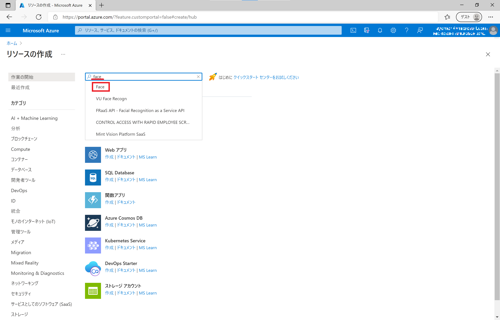
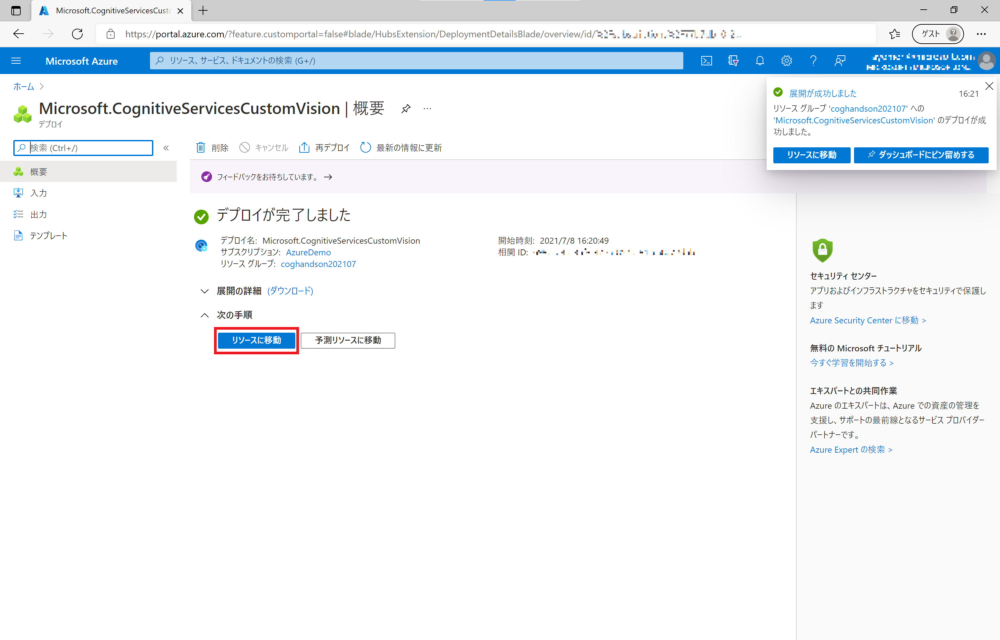
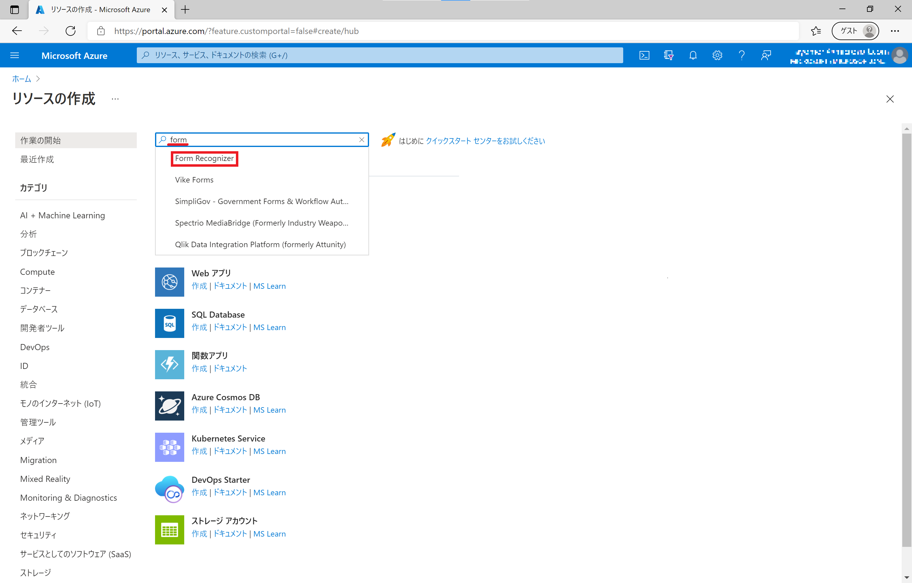

Microsoft Azure Cognitive Services および Applied AI Services は 画像、文章、言語、情報を処理する機能を API 経由で利用できるサービスです。
Azure サブスクリプションをお持ちであれば、Free Tier(F0) と呼ばれる Cognitive Services | Applied AI Services の(当面)無料の料金プランを試用できます。

こちらでは、Cognitive Services | Applied AI Services を試用するためのサービス作成手順を紹介します。

## 目次

- [準備](#準備)
- [Cognitive Services のサービスを作成する](#Cognitive-Services-のサービスを作成する)
    - [Face](#Face)
    - [Custom Vision](#Custom-Vision)
- [Applied AI Services のサービスを作成する](#Applied-AI-Services-のサービスを作成する)
    - [Form Recognizer](#Form-Recognizer)
        - [Azure Storage と Blob コンテナー、SAS URL の作成](#Azure-Storage-と-Blob-コンテナー、-SAS-URL-の作成)

## 準備

- Azure サブスクリプション のサービス申込
    - Azure サブスクリプション の申し込みには マイクロソフトアカウントが必要です。
    - [Azure 無償サブスクリプション準備](https://qiita.com/annie/items/3c9ddc3fb8f120769239) の手順で、Azure サブスクリプション申込を行います(無償以外の有償アカウント等でも問題ありません)。

### Azure Portal でのサブスクリプション確認

[Azure Portal](https://portal.azure.com) にアクセス、Azure サブスクリプションが紐づいたアカウントでサインインします。
Azure Portal の画面で **サブスクリプション** をクリックします。

サブスクリプションの画面で、有効なサブスクリプションが表示されることを確認します。

## Cognitive Services のサービスを作成する

### Face

Azure Portal の Home 画面で **+リソースの作成** をクリックします。

リソースの作成画面で **Face** と入力し、ドロップダウンリストで表示される **Face** をクリックします。

Face のリソース作成画面で **[作成]** をクリックします。

Face の作成 画面でサービス作成に必要な情報を入力して、**[確認および作成]** をクリックします。

- **サブスクリプション**: 紐づけられているサブスクリプション(デフォルト) ※複数お持ちの場合は適切なものを選択
- **リソースグループ**: 作成済みのリソースグループを選択 or **新規作成**をクリックしてご自身で判別しやすい名前を入力
- **リージョン**: ここでは **東日本** を選択
- **名前**: ご自身で判別しやすい名前を入力
- **価格レベル**: ここでは **Free F0**

> 同一サブスクリプション、同一リージョンで F0 は一つまでしか作成できません。その場合は 価格レベルは **S0** を選択します。

> 米国のリージョンを選択した場合は、確認事項のチェックボックスにチェック ☑ をつけます。

*認証に成功しました* というメッセージが表示されるのを確認して、**[作成]** をクリックしてサービスを作成します。

遷移した画面で *デプロイが完了しました* というメッセージが表示されたらサービスの作成は完了です。**[リソースに移動]**　をクリックします。

作成した Face のサービスの詳細が表示されます。左列バーから **キーとエンドポイント** をクリックします。

表示される アクセス **キー1** と **エンドポイント** (Rest API アクセス URL) をコピーしてローカルに保存しておきます。(列右端のファイルアイコンをクリックするとコピーできます)

### Custom Vision

Azure Portal の Home 画面で **+リソースの作成** をクリックします。

リソースの作成画面で **Custom Vision** と入力し、ドロップダウンリストで表示される **Custom Vision** をクリックします。

Custom Vision のリソース作成画面で **[作成]** をクリックします。

Custom Vision の作成 画面でサービス作成に必要な情報を入力して、**[確認および作成]** をクリックします。

- **作成オプション**: ここでは **両方** を選択
- **サブスクリプション**: 紐づけられているサブスクリプション(デフォルト) ※複数お持ちの場合は適切なものを選択
- **リソースグループ**: 作成済みのリソースグループを選択 or **新規作成**をクリックしてご自身で判別しやすい名前を入力
- **名前**: ご自身で判別しやすい名前を入力
- **トレーニングリソースの場所**: ここでは **東日本** を選択
- **トレーニング価格レベル**: ここでは **Free F0**
- **予測リソースの場所**: ここでは **東日本** を選択
- **予測価格レベル**: ここでは **Free F0**

> 同一サブスクリプション、同一リージョンで F0 は一つまでしか作成できません。その場合は 価格レベルは **S0** を選択します。

*認証に成功しました* というメッセージが表示されるのを確認して、**[作成]** をクリックしてサービスを作成します。

遷移した画面で *デプロイが完了しました* というメッセージが表示されたらサービスの作成は完了です。**[リソースに移動]**　をクリックします。

作成した Custom Vision のサービスの詳細が表示されることを確認してください。

> Custom Vision は 画像データからモデルを学習させる **トレーニング(Training)** と 新規画像の分析を行う **予測(Prediction)** の 2 種類のサービスがあります。(今回は両方同時に作成しています。)

## Applied AI Services のサービスを作成する

### Form Recognizer

Azure Portal の Home 画面で **+リソースの作成** をクリックします。

リソースの作成画面で **Form** と入力し、ドロップダウンリストで表示される **Form Recognizer** をクリックします。

Form Recognizer のリソース作成画面で **[作成]** をクリックします。

Form Recognizer の作成 画面でサービス作成に必要な情報を入力して、**[確認および作成]** をクリックします。

- **サブスクリプション**: 紐づけられているサブスクリプション(デフォルト) ※複数お持ちの場合は適切なものを選択
- **リソースグループ**: 作成済みのリソースグループを選択 or **新規作成**をクリックしてご自身で判別しやすい名前を入力
- **リージョン**: ここでは **東日本** を選択
- **名前**: ご自身で判別しやすい名前を入力
- **価格レベル**: ここでは **Free F0**

> 同一サブスクリプション、同一リージョンで F0 は一つまでしか作成できません。その場合は 価格レベルは **S0** を選択します。

*認証に成功しました* というメッセージが表示されるのを確認して、**[作成]** をクリックしてサービスを作成します。

遷移した画面で *デプロイが完了しました* というメッセージが表示されたらサービスの作成は完了です。**[リソースに移動]**　をクリックします。

作成した Form Recognizer のサービスの詳細が表示されます。左列バーから **キーとエンドポイント** をクリックします。

表示される アクセス **キー1** と **エンドポイント** (Rest API アクセス URL) をコピーしてローカルに保存しておきます。(列右端のファイルアイコンをクリックするとコピーできます)

#### Azure Storage と Blob コンテナー、SAS URL の作成

Form Recognizer の学習データなどを保存しておく Azure Blob Storage を作成しておきます。

Azure Portal の Home 画面で **+リソースの作成** をクリックします。

リソースの作成画面に表示されている *ストレーアカウント* の欄にある **作成** をクリックします。

ストレージアカウントを作成する の画面でサービス作成に必要な情報を入力して、**[確認および作成]** をクリックします。

- **サブスクリプション**: 紐づけられているサブスクリプション(デフォルト) ※複数お持ちの場合は適切なものを選択
- **リソースグループ**: 作成済みのリソースグループを選択 or **新規作成**をクリックしてご自身で判別しやすい名前を入力
- **ストレージアカウント名**: ご自身で判別しやすい名前を入力
- **地域**: ここでは **東日本** を選択
- **パフォーマンス**: ここでは **Standard**
- **冗長性**: ここでは **ローカル冗長ストレージ(LRS)**

*検証に成功しました* のメッセージを確認して、**[作成]** をクリックして作成します。

遷移した画面で デプロイが完了しました というメッセージが表示されたらサービスの作成は完了です。[リソースに移動]　をクリックします。

作成したストレージアカウントの詳細が表示されます。左列メニューバーから **Storage Explorer** をクリックします。

ストレージに保存されているデータを編集できる Storage Explorer で Form Recognizer 用の BLOB コンテナーを作成します。Storage Explorer で *BLOB コンテナー* を右クリックし、**BLOBコンテナーの作成** を選択します。

画面右側に表示される *新しいコンテナー* ペインで、名前 (ここでは **form-training**) と入力して、**[作成]** をクリックして作成します。

作成した **form-training** を右クリックして、**Shared Access Signature の作成** を選択します。

画面右側に表示される *Shared Access Signature* ペインで、以下の情報を変更してから **[作成]** をクリックします。

- **有効期間**: デフォルト(+1日) → +1 年
- **アクセス許可**: 表示される全ての操作にチェック

生成された **URL** をコピーしてローカルに保存しておきます。**[コピー]** をクリックすると文字列をコピーできます。

続けて、リソース共有 (CORS) の設定を行います。左列メニューバーから **リソースの共有(CORS)** をクリックします。

*Blob service* のタブで以下の設定を追加し、**[保存]** をクリックして保存します。

- **許可されたオリジン**: *
- **許可されたメソッド**: 全ての項目にチェック☑
- **許可されたヘッダー**: *
- **公開されるヘッダー**: *
- **最長有効期間**: 200

