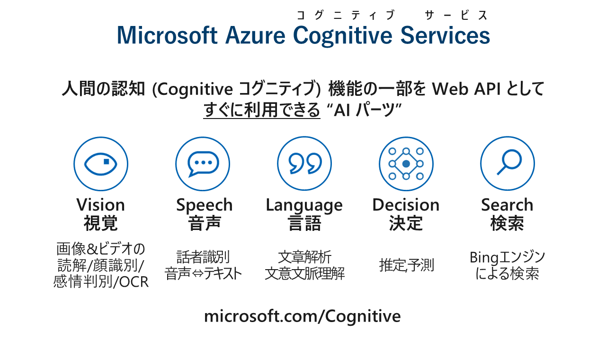
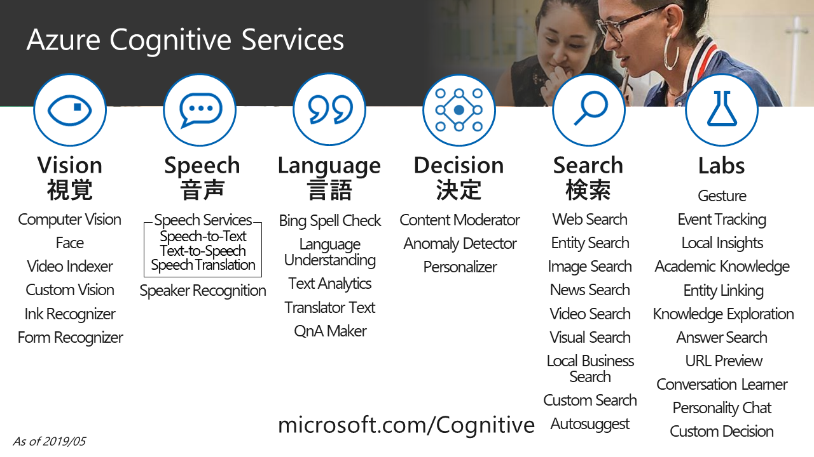

# Azure DX ハンズオン(AI 編) - 2020 年 2 月版

## 人工知能 API" Microsoft Azure Cognitive Services を活用したアプリ開発ハンズオン

"人工知能 API" [Microsoft Azure Cognitive Services](https://www.microsoft.com/cognitive-services/) は、ご自分で学習モデルを構築する手間を省き、画像や音声、テキストなどのさまざまな分析を行う AI エンジンをノーコーディングで利用できるサービスです。

このハンズオンシリーズでは、Cognitive Services の代表的なサービスを活用して、アプリケーションとして利用するまでを体験できます。

- [Microsoft Cognitive Services Face API を利用した 画像識別アプリ 開発 (Face API 表情判定)](https://github.com/ayako/CogServicesVisionSamples_201906/blob/master/FaceHandson_201912.md) : (C# | JavaScript)
- [Microsoft Cognitive Services Custom Vision を利用した 画像識別アプリ 開発 (Custom Vision 犬種判定)](https://github.com/ayako/CogServicesVisionSamples_201906/blob/master/CustomVisionHandson_dog_201908.md) : (C# | JavaScript)
- [Microsoft Cognitive Services を利用した 音声文字起こしアプリ 開発 (202002 版: Speech Services バッチ音声認識)](https://github.com/ayako/AzureDXHol_AI_202001/blob/master/BatchSTTHandson_202002.md) (C#)
- [Microsoft Cognitive Services Text Analytics を利用した お問い合わせアラートシステム 開発](https://github.com/ayako/NonCodingCognitive_201806/blob/master/NonCodingCognitive_AzureLogicApps.md)
- [Microsoft Cognitive Services QnA Maker を利用した FAQチャットボット 開発](https://github.com/ayako/AzureDXHol_AI_202001/blob/master/QnAMakerHandson_201912.md) : (C# | Node.JS)
